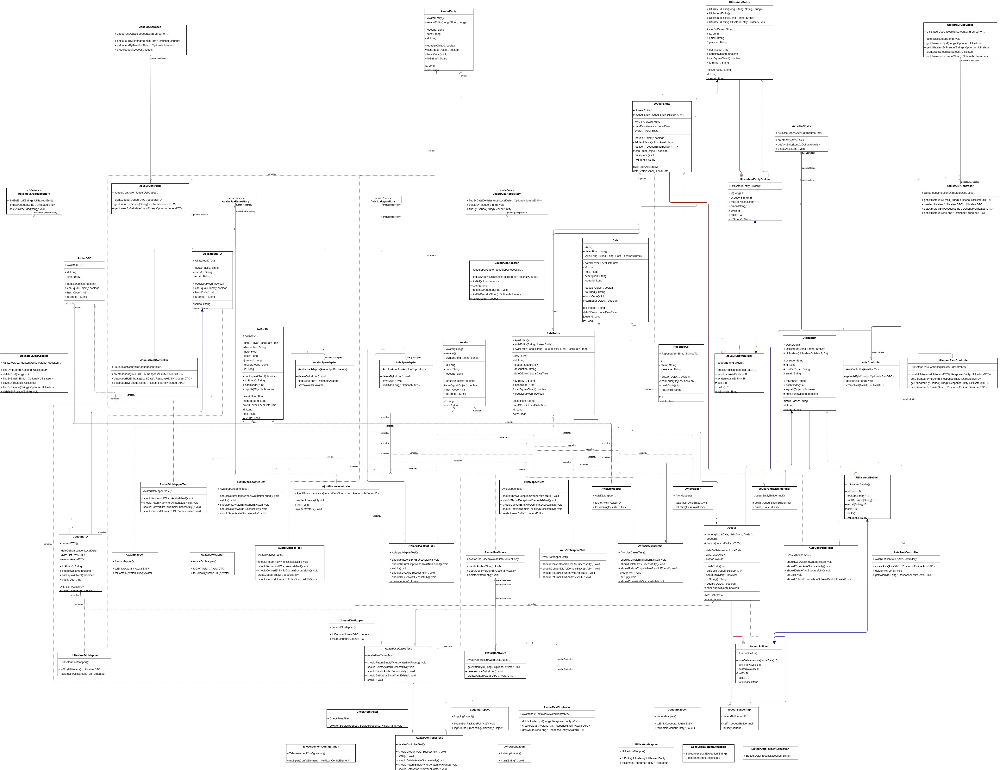
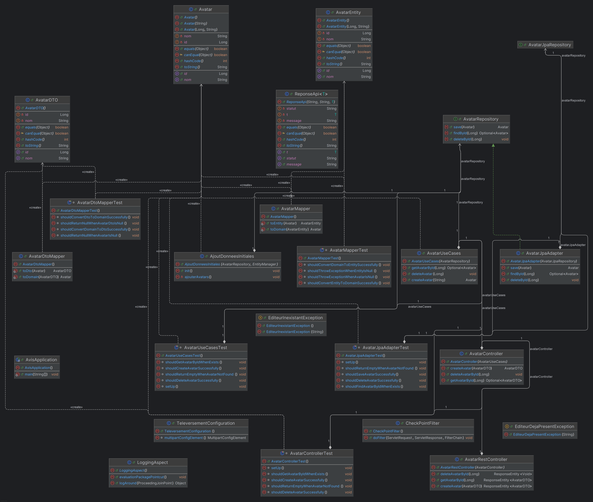
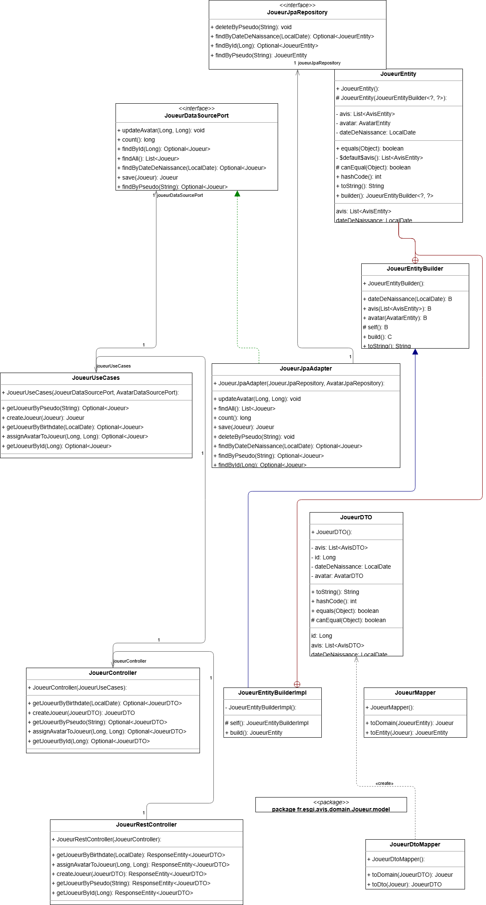
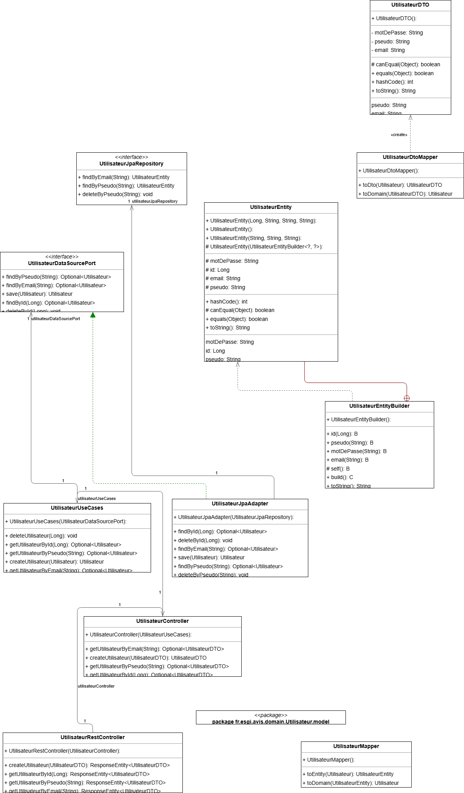
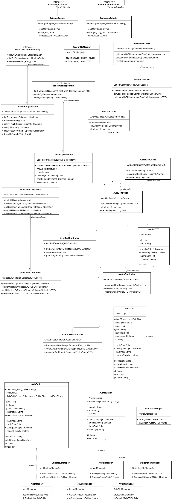

# 📌 Projet : Avis

## Liens utiles : 
- Notion : https://www.notion.so/Clean-Code-1b2449738dcc808587aef6d0a6b29ac0?pvs=4
- Trello : https://trello.com/invite/b/67cec311863296c171fb4b17/ATTId9eb4e2fa4ae3afde4947794c88bbb325B0ADBAD/clean-code
- Github : https://github.com/Bertrand2808/CleanCodeM2Avis

## 🏗️ Architecture du projet

Ce projet suit une architecture **modulaire et hexagonale**, en appliquant les principes du **Clean Code** et de la **Clean Architecture**.

```
📂 src/main/java/fr/esgi/avis
├── 📂 domain
│   ├── 📂 X
│   │   ├── 📂 model
│   │   │   ├── X.java
│   │   ├── XDataSourcePort.java
├── 📂 application
│   ├── 📂 X
│   │   ├── 📂 model
│   │   │    ├── XEntity.java
│   │   ├── XJpaAdapter.java
│   │   ├── XJpaRepository.java
│   │   ├── XMapper.java
├── 📂 useCases
│   ├── 📂 X
│   │   ├── XUseCases.java
├── 📂 controller
│   ├── 📂 X
│   │   ├── 📂 dto
│   │   │    ├── XDTO.java
│   │   ├── 📂 rest
│   │   │    ├── XRestController.java
│   │   ├── XController.java
│   │   ├── XDtoMapper.java
```


## 🛠️ Technologies utilisées
- **Java 23+**
- **Spring Boot 3.4**
- **Spring Data JPA**
- **Mockito / JUnit 5** (pour les tests unitaires)
- **Lombok**
- **H2** (base de données)

---

## 🎯 Principes du Clean Code appliqués

### **1️⃣ Séparation des préoccupations (Separation of Concerns)**
- Le projet est divisé en plusieurs **couches distinctes** :
    - **Domaine (`domain`)** : Définit les objets métier et les interfaces.
    - **Application (`application`)** : Contient les adaptateurs pour la persistance.
    - **Cas d'utilisation (`useCases`)** : Contient la logique métier.
    - **Contrôleur (`controller`)** : Expose les API REST et orchestre les use cases.

### **2️⃣ Dépendance sur l'abstraction (Dependency Inversion)**
- `XUseCases` dépend de **`XDataSourcePort`** et non plus directement d’un repository.
- L’implémentation de la persistance est **découplée** et gérée via **`XJpaAdapter`**.

**Avant (Couplage fort)** :
```java
public class XUseCases {
    private final XRepository xRepository; // ❌ Couplé à JPA
}
```

**Après (Découplé avec un Port) :**
```java
public class XUseCases {
    private final XDataSourcePort xDataSourcePort; // ✅ Indépendant de la persistance
}
```


### **3️⃣ Responsabilité unique (Single Responsibility Principle - SRP)**
- Chaque classe a **une seule raison de changer** :
    - **`XUseCases`** ne contient que la logique métier.
    - **`XRestController`** ne fait que gérer les requêtes HTTP.
    - **`XJpaAdapter`** s'occupe uniquement de l'accès aux données.

### **4️⃣ Open/Closed Principle (OCP)**
- L'architecture est **ouverte à l'extension mais fermée aux modifications** :
    - Ajout d'une nouvelle base de données → **Créer un nouvel adapter sans modifier le domaine**.
    - Ajout d'un autre type d'API (GraphQL, WebSockets) → **Créer un nouveau contrôleur sans modifier le métier**.


### **5️⃣ Tests unitaires et isolation**
- **Tests unitaires (`JUnit 5 + Mockito`)** :
    - Chaque couche est testée indépendamment :
        - **Cas d'utilisation** (`XUseCasesTest`)
        - **Adaptateur de persistance** (`XJpaAdapterTest`)
        - **Mapper DTO** (`XDtoMapperTest`)
        - **Contrôleurs** (`XControllerTest`, `XRestControllerTest`)

### **6️⃣ Utilisation de DTO et Mapper**
- **Pourquoi ?** Ne jamais exposer directement les objets métier.
- **Solution** : `XDtoMapper` transforme `X` ↔ `XDTO`, évitant ainsi les fuites de modèles.

### **7️⃣ Adhérence au principe DRY (Don't Repeat Yourself)**
- **Utilisation de `Lombok`** pour réduire le code répétitif (`@Data`, `@RequiredArgsConstructor`).
- **Mappers centralisés** (`XMapper`, `XDtoMapper`) pour éviter la duplication de code.

# Diagram Principal 




---

## 🧪 Tests et qualité du code

### ✅ **Exécution des tests**
Lancer tous les tests unitaires et d'intégration :
```sh
mvn test
```

# Architecture du projet : détails 

## Avatar endpoint 



## Joueur endpoint



## Utilisateur endpoint



## Avis endpoint

